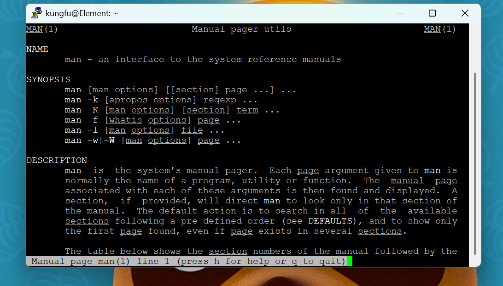

# Day Two #

## Day Two begins with man. ## 

The best thing to remember is to RTFM. Which is **read the freaking manual**,  but I said it in a much nicer tone. There's a manual for everything. There's a manual for the manual. I installed man-db which is the manual database for the Unix/Linux Documentation. I just installed a sweet tool tldr cause ain't nobody got time for that. 

Beyond that I started to navigate the file hierarchy. I am familiar with the directory. I was making directories inside directories. 

MacOS and Linux I believe both based on Unix but they don't run on the same system. They are just incredibly similar. Apple is extremely proprietary meanwhile Linus Torvalds delighted us with such an open source operating system. 

