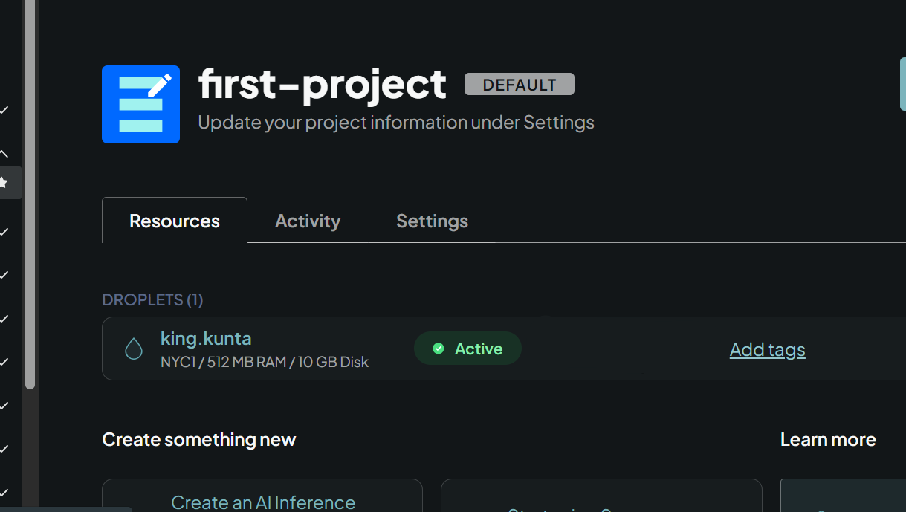

# Day Zero: New Server Created

### In day zero of the challenge I am tasked to start the server in DigitalOcean. ###

The operating system of choice is the ***LTS Ubuntu 24.04***.
I had a couple of "*Am I sure I know what I am doing*" issues, but my server is good and ready to lock and load for the next 30 days.

